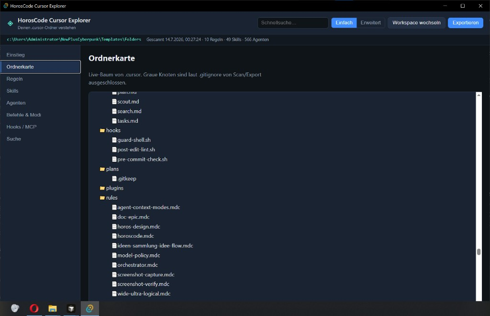
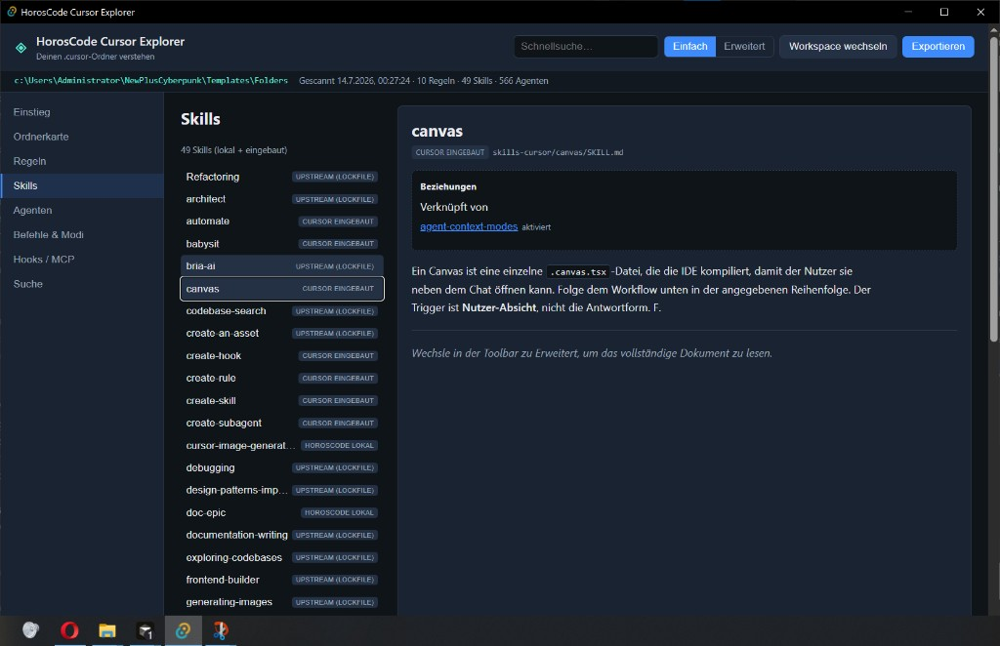

# HorosCode Cursor Explorer

Eine Windows-Desktop-App (Tauri + React), die deinen Workspace-Ordner `.cursor/` scannt und erklärt, wie du Regeln, Skills, Agenten, Befehle, Hooks und MCP-Konfiguration nutzt.

Entwickelt von **HorosCode** für HorosCloud-Template-Workspaces.

## Screenshots

### Einstieg

Willkommens-Dashboard im **Einfach**-Modus: Was `.cursor/` enthält, wie das HorosCode-Team-Avatar-System funktioniert und wann du **Einfach** vs. **Erweitert** nutzt.


### Ordnerkarte

Live-Baum deines `.cursor/`-Ordners. Graue Knoten sind laut `.gitignore` vom Scan und Export ausgeschlossen.



### Regeln

Parst `rules/*.mdc` im **Einfach**-Modus — hier die HorosCode-Regel mit Frontmatter, **Always Apply**-Tags und Beziehungsgraph (verweist auf / verknüpft von).


### Skills

Lokale HorosCode-Skills, Cursor-Eingebaute (`skills-cursor/`) und Upstream-Metadaten — im **Einfach**-Modus mit Kurzbeschreibung und Querverweisen (hier: eingebauter **canvas**-Skill).



### Agenten

Team-Avatar-Roster mit Detailansicht — hier der **HorosCloudV5 Helper Agent** mit Mission, Notfall-Befehlen und Querverweisen.


### Befehle & Modi

Slash-Befehle mit Markdown-Dokumentation; daneben Modus-Parameter (`/lean`, `/wide`, `/doc-epic`, …) — hier der **cactus-juice**-Befehl im **Einfach**-Modus.


### Suche

Volltextsuche über Regeln, Skills, Agenten und Befehle — mit Facetten nach Typ (Regel, Skill, Agent, …) und Quelle (HorosCode lokal, Cursor eingebaut, Upstream).


## Funktionen

- **Ordnerkarte** — Live-Baum mit Ausschluss-Hinweisen aus `.gitignore`
- **Regeln** — parst `rules/*.mdc` Frontmatter + vollständige Inhalte
- **Skills** — lokale HorosCode-Skills, Cursor-Eingebaute (`skills-cursor/`), Upstream-Lockfile-Metadaten
- **Agenten** — Team-Avatar-Roster mit Beziehungslinks
- **Befehle & Modi** — Slash-Befehle + Modus-Parameter-Spickzettel
- **Hooks / MCP** — `hooks.json`, Skripte, `mcp.json`, `permissions.json`
- **Suche** — Volltext mit Typ-/Quellen-Facetten
- **Einfach / Erweitert** — Zusammenfassungen vs. vollständige Inhalte; Einfach-Export schwärzt offensichtliche Geheimnisse
- **Export** — Markdown-Bundle nach `export/` + druckfertiges HTML (Drucken → Als PDF speichern)

## Voraussetzungen

- [Node.js](https://nodejs.org/) 18+ (getestet mit v24)
- [Rust](https://rustup.rs/) stable (für Tauri)
- Windows 10+

## Starten (Entwicklung)

```powershell
cd cursor-explorer
npm install
npm run tauri dev
```

Beim ersten Start erkennt die App automatisch den Workspace-Root (übergeordneter Ordner mit `.cursor`). Nutze **Workspace wechseln**, um einen anderen Ordner zu wählen.

## Build (Produktion)

```powershell
cd cursor-explorer
npm install
npm run tauri build
```

Installer/EXE liegen unter `src-tauri/target/release/bundle/`.

## Starten mit starter.bat (HorosCloud-Template)

Im übergeordneten HorosCode-Template-Ordner liegt `starter.bat` (neben dem Ordner `cursor-explorer/`). Das Skript:

1. Wechselt nach `cursor-explorer/`
2. Startet `src-tauri\target\release\cursor-explorer.exe`, falls vorhanden
3. Sonst Debug-Build oder `npm run tauri dev`

```batch
cd C:\Pfad\zu\Templates\Folders
starter.bat
```

Ohne gebaute EXE zuerst Release bauen:

```powershell
cd cursor-explorer
npm install
npm run tauri build
```

Logs bei Startproblemen: `src-tauri\target\release\starter-launch.log`

## Export

Klicke in der Toolbar auf **Exportieren**. Dateien landen in `<workspace>/export/`:

| Pfad | Inhalt |
|------|--------|
| `README.md` | Bundle-Index |
| `rules/`, `skills/`, `agents/`, `commands/` | Abschnitts-Markdown |
| `configs/` | JSON-Konfigurationen (im Einfach-Modus geschwärzt) |
| `relationships.md` | Querverweis-Karte |
| `cursor-explorer-bundle.html` | Im Browser öffnen → Drucken → Als PDF speichern |

Runtime-Ordner wie `.cursor/projects/` werden **niemals** gescannt oder exportiert.

## Projektstruktur

```
cursor-explorer/
  docs/screenshots/    README-Galerie
  src/                 React-UI
  src-tauri/src/       Rust-Scanner + Export
    scanner.rs         Indexer
    export.rs          Markdown/HTML-Export
    parser.rs          Frontmatter + Referenz-Extraktion
```

## Lizenz

HorosCode internes Template-Tooling.
